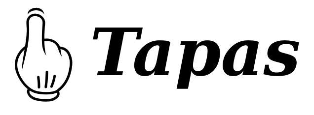

# Tapas

简体中文 | [English](README_en.md)

Tapas 是一门以表达式为核心、注重程序可读性并具有结构化类型系统的编程语言，正在发展为面向复杂系统测试的可编程声明语言。

## 发展方向

Tapas 的目标是让领域规则成为第一类、可组合、可解释的声明。
普通 Tapas 程序可以动态构造这些声明；验证器、生成器和其他解释器则可以从同一份声明派生合法测试状态、行为检查、边界场景、冲突解释和失败缩减。
首要应用方向是复杂有状态系统和 AI Agent 业务环境的测试。
声明应当直接表达领域意图，使读者无需理解底层的执行、生成或求解机制，也能快速理解程序。

用于构造带类型声明中间语言的 `declare`、多解释器接口和测试生成能力目前仍在设计和开发中，不属于当前语言规范。
相关方向见[可验证 Agent 环境设计](docs/paper_or/AgentEnvironment_zh.md)。

## 当前语言实现

当前版本提供了承载上述方向所需的基础语言、类型系统和运行时：

- 简洁、以表达式为核心的语法，以及一等函数、闭包和递归。
- 编译期类型标注、结构 Type、联合 Type、一等 Type 值和运行时反射。
- 常用容器、稠密数组、模块和可复用的 `.tapc` 字节码。
- 语言服务器和 Visual Studio Code 扩展。

Tapas 使用 C23 实现，源码被编译为字节码并由栈式虚拟机执行。Tapas 程序可以作为
脚本运行，也可以通过交互式 REPL 或 Markdown 代码块执行。公共 C API 用于将 Tapas
运行时嵌入其他程序。

## 算法示例

根目录下的 [`examples`](examples) 收录可直接运行的 `.tap` 程序。它们既展示
常见算法，也覆盖 Tapas 的主要语言能力：

| 示例 | 内容与展示重点 |
| --- | --- |
| [Fibonacci](examples/fibonacci.tap) | 用递归和迭代生成 Fibonacci 数列，展示函数递归、循环与列表 |
| [排序算法](examples/sorting.tap) | 实现冒泡、选择、插入、希尔、归并、快速和堆排序，展示切片、高阶函数与原地修改 |
| [二分查找](examples/binary_search.tap) | 在有序列表中查找目标，展示循环边界和提前返回 |
| [欧几里得算法](examples/euclidean_algorithm.tap) | 计算最大公约数、最小公倍数和 Bézout 系数，展示整数运算与多值结果 |
| [埃氏筛](examples/sieve_of_eratosthenes.tap) | 筛选指定范围内的素数，展示布尔列表和嵌套循环 |
| [广度优先搜索](examples/breadth_first_search.tap) | 遍历字典表示的图，展示队列、字典和成员判断 |
| [最长公共子序列](examples/longest_common_subsequence.tap) | 用动态规划求两个字符串的公共子序列，展示二维数组与结果回溯 |
| [牛顿法](examples/newton_method.tap) | 迭代求平方根和非线性方程的根，展示浮点计算与数学函数 |

完整索引和维护约定参见 [`examples/README.md`](examples/README.md)。包含算法讲解、
复杂度分析和输出结果的可执行教程仍保留在 [`docs/examples`](docs/examples)。

## 构建与运行

Tapas 需要支持 C23 的编译器、CMake 3.10 或更高版本和 GNU Readline。

在项目根目录运行：

```sh
cmake -S . -B build
cmake --build build
```

构建完成后，创建 `hello.tap`：

```tapas
print('Hello, Tapas!')
```
<pre class='Tapas-Return'>
Hello, Tapas!
</pre>

运行该文件：

```sh
build/bin/tapas hello.tap
```

也可以直接运行根目录下的算法示例：

```sh
build/bin/tapas examples/fibonacci.tap
```

依赖安装、测试、安装、REPL、命令字符串、字节码和模块路径等用法参见
[使用说明](docs/Usage_zh.md)。

## Visual Studio Code 支持

VS Code 扩展位于 [editors/vscode](editors/vscode)，支持语法高亮、实时诊断、
悬停类型信息、代码补全、定义跳转、引用查找、重命名、工作区模块分析，以及运行
当前 Tapas 文件。

构建项目后即可安装扩展：

```sh
editors/vscode/install.sh
```

安装完成后，在 VS Code 中执行 **Developer: Reload Window**。功能与配置说明详见
[VS Code 扩展说明](editors/vscode/README_zh.md)。

## 在 C 程序中嵌入 Tapas

公共头文件位于 `include/tapas`。以下程序通过会话接口执行一段 Tapas 源码：

```c
#include "tapas/tapas.h"

int main(void)
{
    tsession *session = tsession_new();

    tsession_execute_str(session, "print(6 * 7)", 1);
    tsession_free(session);
    return 0;
}
```

接口、链接方式和扩展类型说明参见 [C 交互](docs/Foreign_zh.md)。

## 文档

- [使用说明](docs/Usage_zh.md)：构建、命令行选项、脚本、字节码、
  Markdown 执行和模块路径。
- [语言规范](docs/Syntax_zh.md)：语法、值类别、运算符、
  语句、函数、模块、数组和内置接口。
- [类型系统设计](docs/TypeSystem_zh.md)：编译期标注、Type 值、结构 Type
  和 `types` 包。
- [可验证 Agent 环境设计](docs/paper_or/AgentEnvironment_zh.md)：实体、状态转换、业务政策、
  场景生成、结果判定和确定性回放。
- [C 交互](docs/Foreign_zh.md)：嵌入会话、注册 C 函数、
  值操作和复合类型扩展。
- [运行机制](docs/Mechanism_zh.md)：编译器、字节码、虚拟机、
  环境和引用计数。
- 示例：[递归斐波那契](docs/examples/Fibonacci_zh.md) 和
  [排序算法](docs/examples/Sort_zh.md)。

## 许可证

Tapas 使用 MIT 许可证发布，详见 [LICENSE](LICENSE)。

## 联系方式

欢迎通过 Issue 反馈问题，也欢迎提交 Pull Request。联系邮箱：
<linsheng.z@outlook.com>。
